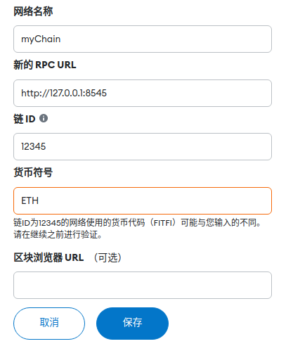
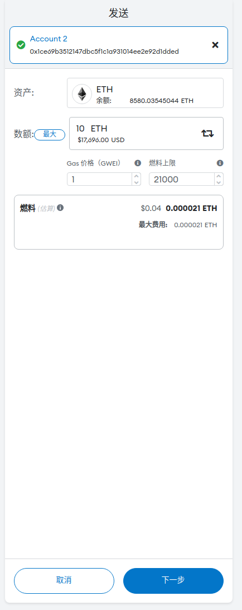
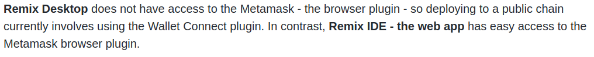

本部分最后一次复现成功的时间：2023.03
### 复现本文档基本要求
- javascript语言阅读及编写
- solidity语言阅读及编写
### 确认环境
```
Ubuntu：22.04.2 LTS
geth：1.11.5-stable
node：18.15.2  
npm：9.6.2 
solcjs：0.8.19
web3js：1.9.0
remix-desktop：1.3.6
```
### 智能合约的部署及调用
之前我们使用了geth提供的一些API与本地以太坊私链进行了简单的交互，笔者接下来将介绍四种可与本地私链进行更丰富、更方便的交互的方法：
- 使用geth的js控制台
- 使用Remix-IDE
- 使用js脚本
- 使用truffle框架
#### 使用geth的js控制台
复现本部分需要注意的是geth提供的web3js库子集的版本很老，需要根据其老版本的指导文档进行操作，笔者使用的geth1.11.5内置web3js版本为0.2.1，其指导文档在[这里](https://github.com/web3/web3.js/blob/0.20.7/DOCUMENTATION.md)。
- 启动节点1
    ```
    > geth --identity "test_node1"  --networkid 11500 --datadir data1 --http --http.addr 127.0.0.1 --http.port 8545 --http.api eth,net,web3 --rpc.enabledeprecatedpersonal --http.corsdomain "*" --authrpc.addr 127.0.0.1 --authrpc.port 8551   --port 30303 --maxpeers 3  --nodiscover --allow-insecure-unlock --dev.period 1 --syncmode full --verbosity 6 console 2>> node1_output.log
    ```
- 在任意位置新建[helloworld.sol](../../src/code_deployed_by_geth_console/helloworld/helloworld.sol)文件，文件内容如下：
    ```
    // SPDX-License-Identifier: MIT
    pragma solidity ^0.8.0;         

    contract helloworld {
        string content;

        constructor(string memory _str){
            content = _str;
        }

        function getContent() view public returns (string memory){
            return content;
        }
    }
    //该文件的代码逻辑过于简单，不对其作过多解释
    ```
- 在helloworld.sol文件所在目录下编译该文件以获得其abi（json格式的合约接口信息）及bytecode（16进制字节码）
    ```
    //检查编译器状态
    > solcjs --version
    //编译以生成需要的信息
    > solcjs --abi ./helloworld.sol -o ./
    > solcjs --bin ./helloworld.sol -o ./
    //查看信息
    > cat ./helloworld_sol_helloworld.abi
    > cat ./helloworld_sol_helloworld.bin
    ```

    注意事项：
    - 生成的文件名为<文件名_合约名>，如果一个文件里有多个合约则会为每个合约生成一个对应的文件。

- 在任意位置新建[helloworld_deploy_by_geth_console.js](../../src/code_deployed_by_geth_console/helloworld/helloworld_deploy_by_geth_console.js)，文件内容如下：
    ```
    //准备工作，可根据实际情况调整
    miner.setEtherbase(eth.accounts[2])     //设定出块奖励受益账户
    personal.unlockAccount(eth.accounts[2],"123456",0)      //解锁要用来部署合约的账户

    //获取合约相关数据
    //将abi设置为helloworld_sol_helloworld.abi中的内容
    var abi = <.abi文件中的内容>;
    //将bytecode设置为helloworld_sol_helloworld.bin中的内容，注意前面要加0x表示16进制
    var bytecode = "0x<.bin文件中的内容>";
    var myString = "helloworld";            //构造函数的实际参数

    //部署合约
    var myContract = web3.eth.contract(abi);        //创建一个新合约（的类型）
    myContract.new(                                 //创建某个合约类型的实例
        myString,
        {             //该字段是交易字段，可以对创建合约的这个交易进行参数设置
            from: eth.accounts[2],          //合约的部署者（交易的发起者）
            data: bytecode,                 //交易的data字段是我们的代码
            gas: 1500000,                   //gas给的多一些保证部署成功
            gasPrice: 19904412217           //汽油费不要太低
        },
        //注意：回调函数会被触发两次一次是该交易被成功提交，一次是交易上链（合约成功部署）
        function(err, myContract){
            if(!err){
                if(!myContract.address){        //交易被成功提交，等待矿工出块
                    console.log("deploying……");
                } else {        //交易上链
                    console.log("Contract deployed! Address: ", myContract.address);
                    console.log("result: ", myContract.getContent.call());
                }
            }
        }
    );

    //挖矿以生成合约实例
    miner.start(1);admin.sleepBlocks(1);miner.stop();
    ```
- 在geth控制台内执行两遍helloworld_deploy_by_geth_console.js：
    ```
    > loadScript(<脚本文件路径>);
    > loadScript(<脚本文件路径>);
    ```

观察可以发现：
- 创建合约实例的时候提交了一个交易而且节点也判断出这是创建合约的交易，日志给出了类似如下输出：
    ```
    Submitted contract creation hash=<交易的哈希值> from=<部署合约的账户> nonce=<这个账户的用于防止双花攻击的nonce>  contract=<即将创建合约的地址> value=<交易携带的金额>
    ```
- 成功返回了`getContent`函数的调用结果`"helloworld"`
- 脚本执行了两遍，在两个不同的地址上部署了相同的合约

注意事项：
- 该脚本可重复执行，每执行一次都会根据其内容部署一个合约
- 我们也可以在脚本内使用`myConstract.at("<合约实例的地址>")`来获取一个合约实例

### 使用Remix-IDE
&emsp;&emsp;Remix-IDE是一个易于初学者使用的集成开发环境，笔者在此将使用remix提供的两种方法进行合约的部署及测试。
#### External HTTP Provider——直接与本地/远程区块链交互
- 启动节点1
    ```
    > geth --identity "test_node1"  --networkid 11500 --datadir data1 --http --http.addr 127.0.0.1 --http.port 8545 --http.api eth,net,web3 --rpc.enabledeprecatedpersonal --http.corsdomain "*" --authrpc.addr 127.0.0.1 --authrpc.port 8551   --port 30303 --maxpeers 3  --nodiscover --allow-insecure-unlock --dev.period 1 --syncmode full --verbosity 6 console 2>> node1_output.log
    ```
- 设置矿工账户并解锁要部署合约的账户
    ```
    > miner.setEtherbase(eth.accounts[0])
    > personal.unlockAccount(eth.accounts[2],"123456",0)
    ```
- 在remix中打开[helloworld.sol](../../src/code_deployed_by_remixIDE/helloworld/helloworld.sol)文件，其文件内容同上。
- 打开左侧`Deploy&run transaction`界面，选择环境`Custom-External HTTP Provider`

- 在`1`处填入节点1的HTTP-RPC服务的网络地址，在`2`处选择刚刚解锁的账户3为合约的部署者，在`3`处填入构造函数的参数`helloworld`，点击`4`部署合约

    观察可以发现：  
    - 节点1的交易池中出现了新的合约部署交易等待上链
- 在节点1执行挖矿
    ```
    miner.start(1);admin.sleepBlocks(1);miner.stop();
    ```
- 观察`1`处的交易上链信息并点击`2`调用合约的`getContent`方法：


    观察可以发现：
    - 执行合约中的方法时节点会输出日志`Executing EVM call finished`

    注意事项：
    - 在以太坊EVM中调用不改变状态的函数比如`view`或`pure`函数时仅返回储存在合约中的数据并不会提交新的交易
#### Injected provider——借助其它工具间接与区块链交互
- MetaMask钱包的安装及使用
    - 进入[MetaMask官网](https://metamask.io/)下载相应浏览器的插件并进行初始账户设置
    - 下载完成后进入`设置->网络->添加网络->手动添加网络`，使用如下网络配置：  
    
    - 选择配置的私联并确保节点1已经启动，将节点1已有的5个账户导入。导入时选择`JSON文件`类型的导入并选择存放在`data1/keystore/`中的账户私钥json文件，密码是创建账户时设置的`123456`
    - 耐心等待账户导入完成（我这里导入一个账户需要大约6分钟）。此时账户列表里出现了6个账户（1个初始账户+5个导入的账户），若想将MetaMask初始账户导出到本地请参考[这里](https://blog.csdn.net/weixin_43988498/article/details/108394012)，本文不过多赘述
    - 发起账户4到账户2的两个以太币的转账交易以测试MetaMask与私链链接是否正常  
      
        观察可以发现：
        - 节点1的pending交易池中出现了新的转账交易 
    - 在节点1执行挖矿操作
        ```
        > miner.setEtherbase(eth.accounts[0])
        > personal.unlockAccount(eth.accounts[2],"123456",0)
        > miner.start(1);admin.sleepBlocks(1);miner.stop();
        ```
        观察可以发现：
        - MetaMask的账户2获得了2个以太币的出块奖励和账户4的转账
        - MetaMask的账户4的`活动`标签卡中出现了转账记录
- remix链接MetaMask
    - 查阅remix-ide官方github仓库发现其现已不支持通过`Injected provider`和MetaMask链接：  
    
    - [进入remix-web-app](https://remix.ethereum.org)，打开并编译用于测试的helloworld.sol文件
    - 保证MetaMask正在运行，在部署页面选择`Injected Provider - MetaMask`。在弹出的窗口内授权remix可以访问所有MetaMask账户
    - 选择一个账户作为合约的部署者（在MetaMask中切换到账户4），填入合约构造函数的参数`helloworld`，点击部署并在MetaMask中确认该合约部署交易。
    - 执行挖矿使交易上链，之后在remix中调用合约中的`getContent`函数（步骤同上）
### 使用node运行基于web3js库的js脚本
- 启动节点1
    ```
    > geth --identity "test_node1"  --networkid 11500 --datadir data1 --http --http.addr 127.0.0.1 --http.port 8545 --http.api eth,net,web3 --rpc.enabledeprecatedpersonal --http.corsdomain "*" --authrpc.addr 127.0.0.1 --authrpc.port 8551   --port 30303 --maxpeers 3  --nodiscover --allow-insecure-unlock --dev.period 1 --syncmode full --verbosity 6 console 2>> node1_output.log
    ```
- 在控制台内设置矿工账户并解锁用于部署合约的账户
    ```
    > miner.setEtherbase(eth.accounts[2])
    > personal.unlockAccount(eth.accounts[2],"123456",0)
    ```
- 在任意位置新建[helloworld.sol](./helloworld/helloworld.sol)，文件内容和之前一样
- 在同级目录下新建[helloworld_deployed_by_web3js.js](./helloworld/helloworld_deployed_by_web3js.js)，文件内容如下：
    ```
    //引入所需要的模块（各种库）
    var solc = require('solc')
    var fs = require('fs')
    var Web3 = require('web3');

    //以utf-8格式读取solidity代码
    var contractCode = fs.readFileSync("helloworld.sol", "utf-8")
    //设置solidity编译器的标准JSON输入
    var input = {
        "language": "Solidity",
        "sources": {
        "helloworld.sol": {
            "content": contractCode
        }
        },
        "settings": {
        "outputSelection": {
            "*": {
            "*": ["*"]
            }
        }
        }
    };
    //将标准JSON输入转换成字符串进行编译后再转换成标准JSON输出
    var output = JSON.parse(solc.compile(JSON.stringify(input)))
    //获取helloworld合约的abi接口信息及字节码
    var helloworld_abi = output.contracts['helloworld.sol']['helloworld'].abi
    var helloworld_bytecode = output.contracts['helloworld.sol']['helloworld'].evm.bytecode.object

    // 测试编译结果
    // console.log(output.contracts)
    // for (var contractName in output.contracts['helloworld.sol']) {
    //     console.log(
    //       contractName +
    //         ' contract ABI: ' +
    //         JSON.stringify(output.contracts['helloworld.sol'][contractName].abi, null, 2)
    //     );
    //     console.log(
    //         contractName +
    //         ' contract byteCode: ' +
    //         JSON.stringify(output.contracts['helloworld.sol'][contractName].evm.bytecode.object)
    //     )
    //     console.log()
    // }

    //获得新的web3实例
    var web3 = new Web3('http://127.0.0.1:8545')
    //获得具有某种abi接口的新的合约类型
    var myContract = new web3.eth.Contract(helloworld_abi)
    web3.eth.getAccounts().then( accounts => {      //获取该web3实例中的本地账户accounts，之后执行某匿名函数（参数：accounts）
        myContract.deploy({                 //生成合约部署交易
            data: helloworld_bytecode,      //待部署合约的字节码
            arguments: [                    //待部署合约的构造函数实参（数组形式）
                'helloworld!'
            ]
        })
        .send({                             //发送该合约部署交易
            from: accounts[2],
            gas: 1500000,
            gasPrice: '19904412217'
        }, (err, transactionHash) => {      //当合约部署交易发送成功后执行该回调函数（参数：错误信息err，成功发送的交易的哈希transactionHash
            if( !err ){
                console.log("TransactionHash: " + transactionHash)          //交易成功发送后返回交易的hash
                console.log("Waiting for mine")
            } else {
                console.log("Deploy error: " + err)
            }
        })
        .on('receipt', (receipt) => {       //当该交易的收据可用（交易成功上链）时执行某匿名函数（该交易的收据receipt）
            console.log("Mined! (contractAddress: " + receipt.contractAddress + ")")        //打印合约实例（合约账户）的地址
        })
        .then( (result) => {                //当合约实例部署完成时执行某匿名函数（参数：成功部署的合约实例）
            result.methods.getContent().call( (err, returnValue) => {       //执行合约的getContent方法，执行完成后执行回调函数（参数：错误信息err，方法的返回值returnValue）
            if( !err ){
                console.log("Call helloworld.getContent() (returnValue: " + returnValue + ")")
            } else {
                console.log("Call helloworld.getContent() Error! " + err)
            }
            })
        })
    })
    ```
    注意事项：
    - 本代码参考[web3js官方文档](https://web3js.readthedocs.io/en/v1.9.0/index.html)及[solcjs官方文档](https://github.com/ethereum/solc-js)编写而成
    - 关于如何构建更有效的编译器输入输出请参考solidity官方文档中的[Compiler Input and Output JSON Description](https://docs.soliditylang.org/en/v0.8.19/using-the-compiler.html#compiler-input-and-output-json-description)
- 在终端内运行脚本
    ```
    > node <脚本文件路径>
    ```

    观察可发现：
    - 成功提交了合约部署交易返回了交易的哈希值，节点中的交易池中也显示了相关信息
    - 脚本的执行处于等待挖矿的状态

    注意事项：
    - 关于node的使用及其包管理笔者不在此作过多阐述，如果脚本运行出现无法找到模块等问题请读者自行搜索解决方案
- 命令节点进行挖矿，打包合约部署交易
    ```
    > miner.start(1);admin.sleepBlocks(1);miner.stop();
    ```

    观察可以发现：
    - 脚本执行完成，输出合约实例的地址及测试函数期望的返回值`helloworld!`
### 本部分悬而未决的问题
- 可能的代码优化：使用函数式编程